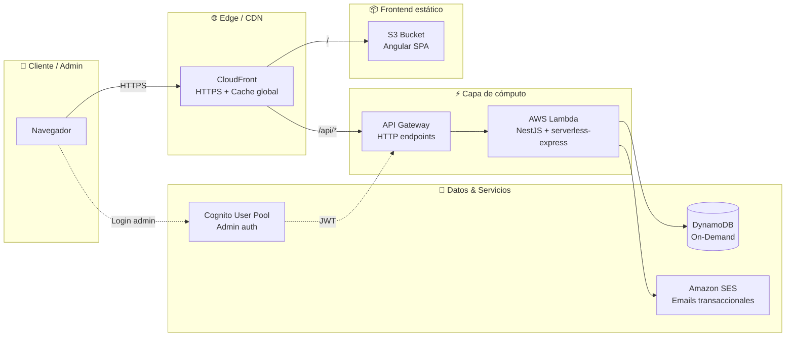

<div align="center">

# 🌴 Tour Vacation

**Plataforma web + panel de autogestión sobre arquitectura 100% serverless en AWS**

[](https://angular.dev)
[](https://nestjs.com)
[](https://www.typescriptlang.org)
[](https://nodejs.org)

[](https://aws.amazon.com/lambda)
[](https://aws.amazon.com/api-gateway)
[](https://aws.amazon.com/dynamodb)
[](https://aws.amazon.com/s3)
[](https://aws.amazon.com/cloudfront)
[](https://aws.amazon.com/ses)

</div>

---

## 📑 Tabla de contenidos

- [Visión general](#-visión-general)
- [Características (Plan Premium)](#-características-plan-premium)
- [Arquitectura](#️-arquitectura)
- [Stack técnico](#️-stack-técnico)
- [Estructura del monorepo](#-estructura-del-monorepo)
- [Empezando](#-empezando)
- [Scripts disponibles](#-scripts-disponibles)
- [Desarrollo local](#-desarrollo-local)
- [Modelo de datos](#-modelo-de-datos-dynamodb)
- [Despliegue](#️-despliegue)
- [Costos esperados](#-costos-esperados)
- [Convenciones](#-convenciones)

---

## 🎯 Visión general

Tour Vacation es una plataforma web pensada para mostrar planes turísticos al público y permitir que el equipo administrativo (≈4 personas) los gestione desde un panel privado, sin tener que tocar código ni infraestructura.

La arquitectura es **100% serverless en AWS**: no hay servidores 24/7, no hay PM2 que vigilar, no hay sistemas operativos que parchear. El objetivo es **mantener el costo operativo cerca de $0 USD/mes** mientras el tráfico sea bajo, y que escale automáticamente si crece.

---

## ✨ Características (Plan Premium)

| Módulo | Descripción |
|---|---|
| 🏠 **Landing Page** | Página principal responsive, optimizada para móviles, respetando el manual de marca (colores, tipografía, identidad). |
| 🔐 **Panel de Administración** | Acceso privado y seguro para administrar planes, precios e imágenes publicadas en la web con un par de clics. |
| 📝 **Captura de Leads** | Formulario público que guarda los datos de contacto de los interesados directamente en la base de datos. |
| 📧 **Automatización de Emails** | Apenas se carga un lead, el sistema envía un email de bienvenida o con la oferta detallada vía Amazon SES. |
| 👥 **Directorio de Clientes** | Vista en el panel para listar, filtrar y exportar a CSV todos los interesados — pensada para seguimiento comercial. |

---

## 🏗️ Arquitectura



### Componentes y su rol

| Capa | Servicio AWS | Rol |
|---|---|---|
| 🌐 **CDN / TLS** | CloudFront | Distribución global, HTTPS gratis, protege el bucket de S3 |
| 📦 **Hosting estático** | S3 | Aloja el build de Angular (HTML / CSS / JS) |
| 🚪 **API Gateway** | API Gateway HTTP API | Expone endpoints y enruta a Lambda |
| ⚡ **Cómputo** | Lambda | Ejecuta NestJS sólo cuando hay peticiones — adaptado con `@vendia/serverless-express` |
| 💾 **Base de datos** | DynamoDB (On-Demand) | NoSQL serverless, perfecto para el volumen esperado |
| 📧 **Email** | SES | Emails transaccionales (bienvenida / detalles de oferta) |
| 🔐 **Auth admin** | Cognito User Pool | Login de los ~4 admins, JWT validado en API Gateway |
| 🔑 **Auth servicio↔servicio** | IAM Roles | Sin credenciales en código ni en `.env` |

---

## 🛠️ Stack técnico

**Frontend**
- Angular 19 (standalone components, routing, SCSS)
- Build estático (sin SSR) — listo para subir a S3
- Form reactivos para captura de leads
- Guard de rutas admin contra Cognito

**Backend**
- NestJS 11 + TypeScript (modo `strict`)
- `@vendia/serverless-express` para correr en Lambda preservando el dev local
- AWS SDK v3 (`@aws-sdk/client-dynamodb`, `@aws-sdk/lib-dynamodb`, `@aws-sdk/client-ses`)
- Validación con `class-validator` + `class-transformer`

**Infra / DevOps**
- Monorepo con npm workspaces
- IaC por definir (AWS SAM / CDK / Serverless Framework)

---

## 📁 Estructura del monorepo

```
tour-vacation/
├── 📄 package.json          → npm workspaces (frontend + backend)
├── 📄 README.md             → este archivo
├── 📄 CLAUDE.md             → guía operativa para Claude Code
├── 📄 .gitignore
│
├── 📦 frontend/             → Angular SPA
│   ├── src/
│   │   ├── app/             → componentes, rutas, servicios
│   │   ├── assets/
│   │   └── styles.scss
│   ├── angular.json
│   └── package.json
│
└── 📦 backend/              → NestJS API (Lambda-ready)
    ├── src/
    │   ├── main.ts          → entry local + handler Lambda
    │   ├── app.module.ts
    │   └── modules/         → leads, plans, auth, etc.
    ├── nest-cli.json
    └── package.json
```

---

## 🚀 Empezando

### Requisitos

- **Node.js 22 LTS** (recomendado) o superior
- **npm 10+**
- **AWS CLI** configurado (sólo necesario para deploy)
- Cuenta de AWS con permisos para crear Lambda, S3, DynamoDB, SES, Cognito y CloudFront

### Instalación

Desde la raíz del monorepo, una sola vez:

```bash
npm install
```

Esto instala las dependencias del root, del frontend y del backend gracias a **npm workspaces**.

---

## 📜 Scripts disponibles

Todos se ejecutan desde la raíz del proyecto:

| Script | Descripción |
|---|---|
| `npm run start:frontend` | Levanta Angular en `http://localhost:4200` (hot reload) |
| `npm run start:backend` | Levanta NestJS en `http://localhost:3000` (watch mode) |
| `npm run build:frontend` | Build estático listo para subir a S3 → `frontend/dist/` |
| `npm run build:backend` | Build de NestJS → `backend/dist/` |
| `npm run test:frontend` | Tests del frontend (Karma + Jasmine) |
| `npm run test:backend` | Tests del backend (Jest) |

---

## 💻 Desarrollo local

En dos terminales separadas:

```bash
# Terminal 1 — backend
npm run start:backend
# → http://localhost:3000

# Terminal 2 — frontend
npm run start:frontend
# → http://localhost:4200
```

Para evitar CORS en local, el frontend usa un `proxy.conf.json` que redirige `/api/*` al backend en `:3000`. *(Pendiente de configurar — ver CLAUDE.md.)*

Los servicios AWS (DynamoDB, SES, Cognito) se pueden emular localmente con:
- **DynamoDB Local** (Docker o JAR oficial)
- **MailHog / smtp4dev** para capturar emails
- **cognito-local** para auth (opcional)

---

## 💾 Modelo de datos (DynamoDB)

> ⚠️ Borrador inicial — se ajustará al implementar.

### Tabla `Plans`
| Atributo | Tipo | Notas |
|---|---|---|
| `planId` (PK) | String | UUID |
| `title` | String | "Bariloche 5 días" |
| `priceUsd` | Number | |
| `description` | String | |
| `imageUrl` | String | URL pública (CloudFront) |
| `active` | Boolean | Para ocultar sin borrar |
| `displayOrder` | Number | Orden en la landing |
| `createdAt` / `updatedAt` | String (ISO) | |

### Tabla `Leads`
| Atributo | Tipo | Notas |
|---|---|---|
| `leadId` (PK) | String | UUID |
| `email` | String | |
| `name` | String | |
| `phone` | String | |
| `interestedPlanId` | String | FK lógica a `Plans` |
| `source` | String | "landing-form", etc. |
| `createdAt` | String (ISO) | |
| `emailSent` | Boolean | Trazabilidad del SES |

---

## ☁️ Despliegue

| Recurso | Destino |
|---|---|
| `frontend/dist/` | Bucket S3 detrás de CloudFront |
| `backend/dist/` | Empaquetado y subido a Lambda |
| DynamoDB | Tablas creadas vía IaC (CDK/SAM) |
| Cognito User Pool | Creado vía IaC, los 4 admins se invitan manualmente |
| SES | Dominio verificado + identidad de envío |

> El IaC concreto y los scripts de deploy se definen en una próxima iteración (ver `CLAUDE.md` → *Próximos pasos*).

---

## 💸 Costos esperados

Con el tráfico esperado (sitio promocional + 4 admins + pocos leads/día), el stack queda dentro de la capa gratuita permanente o paga centavos:

| Servicio | Capa gratuita | Estimación mensual |
|---|---|---|
| S3 | 5 GB + 20k GETs | ~$0 |
| CloudFront | 1 TB egress + 10M requests / 12 meses | ~$0 |
| Lambda | 1M invocaciones + 400k GB-s / mes (permanente) | ~$0 |
| API Gateway | 1M requests / 12 meses, luego ~$1/M | <$1 |
| DynamoDB On-Demand | 25 GB + reads/writes acotados | ~$0 |
| SES desde Lambda | 62k emails / mes (permanente) | ~$0 |
| Cognito | 50k MAU (permanente) | ~$0 |

**Total esperado: $0 – $2 USD/mes.**

---

## 📐 Convenciones

- **TypeScript strict** en todo el repo
- **Commits** en presente, en español, cortos (`fix:`, `feat:`, `chore:`)
- **PRS** Completamente claros mostrando el por qué de un cambio. Máximo 15 archivos por PR. Manejando siempre gitflow (`fix:`, `feature:`, `release:`)
- **Variables de entorno** sólo para config no sensible — los secretos viven en **AWS Secrets Manager / Parameter Store**, nunca en `.env` versionado
- **Sin SQL ORMs** ni conexiones persistentes — Lambda es stateless
- **Sin containers, EC2 ni RDS** — rompen el objetivo de costo

---

<div align="center">

Hecho con ☕ y AWS Free Tier.

</div>
